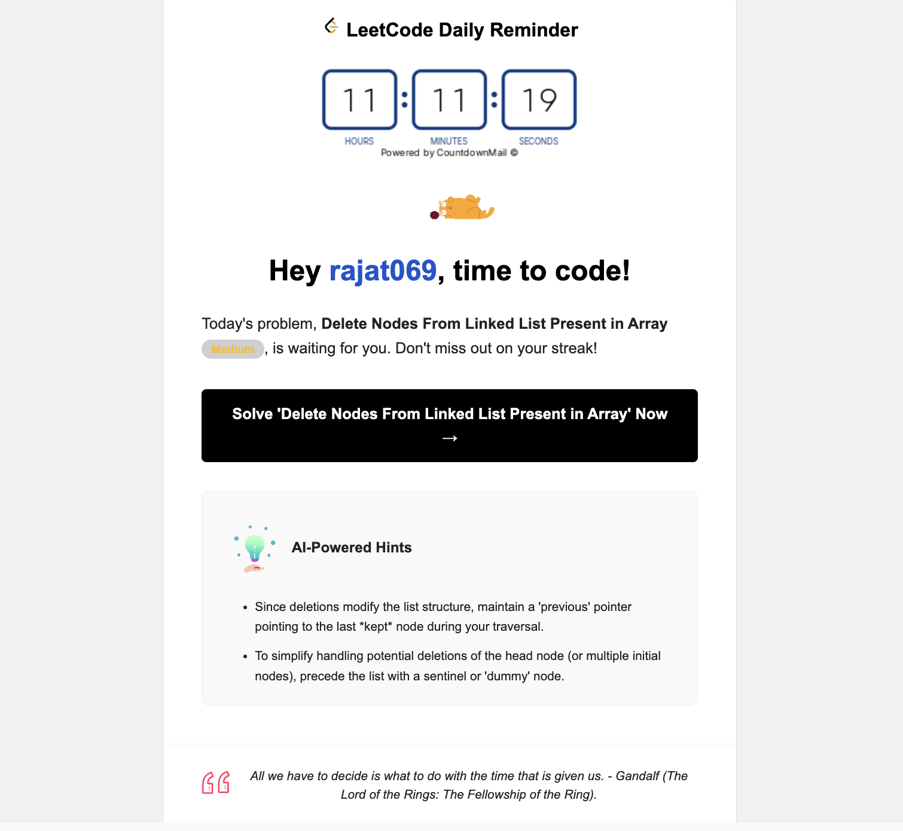
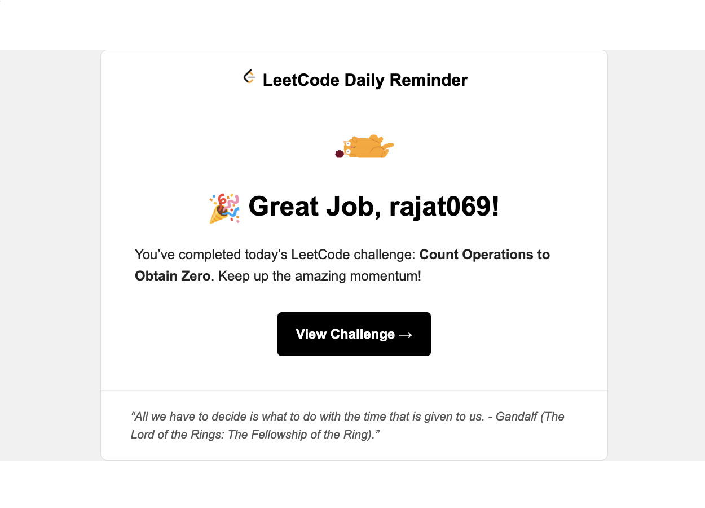
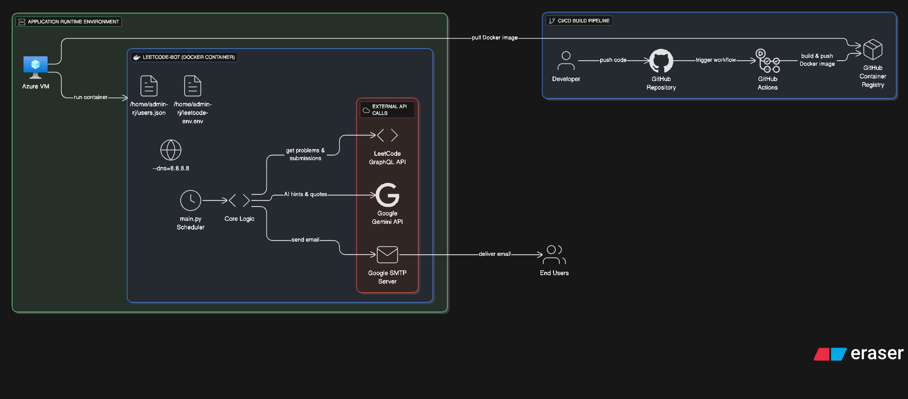

# LeetCode Reminder Bot

[](https://github.com/rajat069/leetcode-reminder-bot/actions/workflows/build-image.yml)
[](https://github.com/orgs/Rajat069/packages?repo_name=leetcode-reminder-bot)
[](https://www.python.org/)
[](https://opensource.org/licenses/MIT)

---

### About

**LeetCode Reminder Bot** is a smart, containerized reminder bot that **keeps you consistent** with your daily LeetCode practice — and gives you **AI-powered hints** when you need them most!

It checks whether users have solved the **Problem of the Day**, then:
- Sends a **Reminder Email** (with AI hints + motivational quotes) if unsolved.
- Sends a **Congratulations Email** when solved.

> Built for developers who want to stay sharp, motivated, and consistent — all automatically.

---

## Key Features

### Smart Email Logic
- Sends **“Congratulations”** or **“Reminder”** emails automatically.
- Dynamic templates keep every message engaging.

### AI-Powered (Gemini)
- **Adaptive Hints:** Number of hints varies by difficulty and acceptance rate.  
- **Helpful Hints:** Uses official problem data to generate intuitive AI hints.  
- **Motivational Quotes:** Fetches inspiring movie quotes to boost motivation.

### Fully Containerized
- Runs as a **single lightweight Docker container**.  
- Supports both **amd64** and **arm64** architectures (Intel/AMD + Apple/Raspberry Pi).
---

## 🖼️ Gallery

| Reminder Email (Unsolved) |  Congratulations Email (Solved) |
|----------------------------|--------------------------------|
|  |  |

---

## 🏗️ Architecture Overview

**“Set it and forget it” — built for autonomous operation.**


### Prerequisites

- A VM/server with **Docker installed**
- A **GitHub Personal Access Token (PAT)** with `read:packages` scope
- **GMAIL_APP_PASSWORD** & **GEMINI_API_KEY**

---
### Step 1: Log in to GHCR

```bash
sudo docker login ghcr.io -u YOUR_USERNAME -p YOUR_PAT
``` 
### Step 2: Create Configuration Files
```bash

/home/{vm-username}/leetcode.env
```
> Note: Replace {vm-username} with your actual VM's username.

```
GMAIL_APP_PASSWORD=YOUR_GMAIL_APP_PASSWORD_HERE
SMTP_USER={your-mail}@gmail.com
GEMINI_API_KEY=YOUR_GEMINI_API_KEY_HERE
/home/{vm-username}/users.json
```
>Note: Replace {your-mail} with your actual e-mail.
>environment variables should not have any quotes `""`.

Your user list in JSON format.
```json
[
  {
    "username": "pam",
    "email": "pam06@gmail.com"
  },
  {
    "username": "simrunn",
    "email": "simranxxxxx@gmail.com"
  }
]
```
🧠 Step 3: Run the Bot
Pull and start the service with one command:
```bash
sudo docker run \
    --detach \
    --restart=always \
    --name leetcode-bot \
    --dns=8.8.8.8 \
    --env-file /home/{vm-username}/leetcode.env \
    -v /home/{vm-username}/users.json:/app/users.json \
    ghcr.io/{github-username}/leetcode-reminder-bot:latest
```
> Note: Replace {vm-username} and github-username} with your actual details.

Check logs anytime:

```bash
sudo docker logs -f leetcode-bot
```
## Local Development

1. Clone the Repository
2. Create a .env File with all variables mentioned above
3. Create a users.json File
4. Install Dependencies using following command
``` bash
pip install -r requirements.txt
```
5. Run Locally
``` bash
python main.py
```

## To Dos
- [x] Add gemini-service   
- [ ] Implement caching for static operations 
- [ ] Enhance email UI

## Configuration Reference

| Variable | Description | Required | Default |
| :--- | :--- | :--- | :--- |
| `GMAIL_APP_PASSWORD` | Google App Password for email sending | ✅ Yes | — |
| `SMTP_USER` | Gmail address used for SMTP | ✅ Yes | — |
| `GEMINI_API_KEY` | API key from Google AI Studio | ✅ Yes | — |
| `SMTP_SERVER` | SMTP server hostname | ❌ No | `smtp.gmail.com` |
| `SMTP_PORT` | SMTP port number | ❌ No | `587` |

## License
This project is licensed under the MIT License. See the `LICENSE` file for details.
